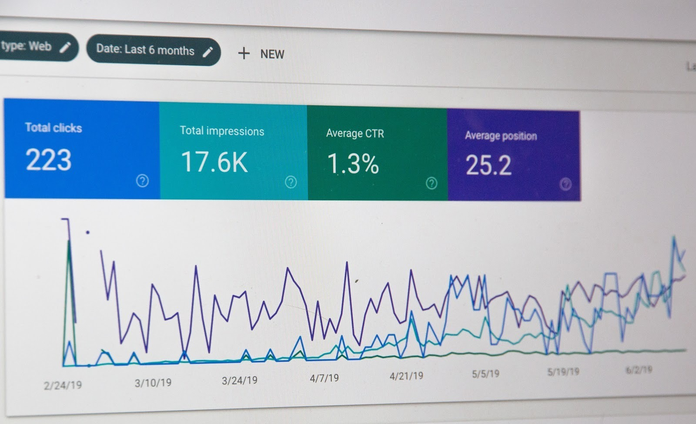

title:: Dasar Visualisasi Data 
sources:: https://dicoding.com

- # Media Visualisasi
	- ## Tabel
	- Hal yang perlu diperhatikan dalam penulisan tabel:
		- Penulisan judul
		- ### Simpel
			- [[KISS (Keep It Simple Stupid)]]. Jangan terlalu berlebihan dalam mendesain sebuah tabel agar orang membaca tidak terdistraksi.
		- ### Penjelasan simbol
			- Apabila terdapat catatan pada salah satu nilai dalam tabel, beri simbol *superscript* (e.g.: * † ‡) dan beri penjelasan simbol pada catatan kaki tabel.
		- ### Penekanan
			- Memberi fokus atau ringkasan agar dibaca lebih cepat seperti memberi angka total atau warna kolom untuk nilai yang sama.
		- ### Sumber tabel
	- ## Diagram
		- Presentasi data dalam bentuk grafik, seperti:
			- ### Diagram batang
				- Perbandingan angka pada kategori tertentu
				- Jumlah elemen (sumbu x) sebaiknya tidak terlalu banyak agar label kategori masih bisa terlihat dengan baik.
				- Hindari penulisan label vertikal atau diagonal
				- Perhatikan warna yang digunakan
			- ### Diagram lingkaran
				- Menunjukkan jumlah relatif dari kuantitas suatu data satu sama lain
				- Menunjukkan keseluruhan data dan kuantitas sebuah kategori data itu sendiri relatif vis a vis atau berhubungan dengan keseluruhan data yang ada
				- Usahakan maksimal 5 irisan supaya tidak menyulitkan pembaca dan juga menghindari bias antara data satu dengna yang lainnya
			- ### Diagram garis
				- Perubahan data dalam periode waktu tertentu
				- Data yang berlangsung secara terus menerus atau berkelanjutan, seperti:
					- Perkembangan jumlah penduduk selama 10 tahun terakhir
					- Pertumbuhan ekonomi dari tahun ke tahun
				- Sumbu X adalah interval waktu
				- Sumbu Y adalah kuantitas/nilai
- # Visualisasi Data dalam Bisnis
	- ## Scorecard
		- Berfokus pada sebuah jenis data yang spesifik, seperti: jumlah pendapatan, kepuasan pelanggan, dan hal lainnya yang dapat dibandingkan dengan target yang telah ditentukan.
		  collapsed:: true
			- 
		- Menggambarkan salah satu *Key Proformance Indicators* (KPI) perusahaan yang lebih sederhana untuk memantau kemajuan progres
	- ## Dashboard
		- Kumpulan dari berbagai macam visualisasi data dalam satu halaman agar lebih mudah dipantau.
		- Kumpulan scorecard juga dapat disebut dashboard
		- Grafik yang ditampilan dalam satu halaman saling berhubungan
	- ## Report
	- ## Analytical Report
		- Menggunakan data kualitatif dan kuantitatif
		- Menganalisis dan mengevaluasi ide dari suatu bisnis
		- Memberi insight lebih ke pembaca secara ringkas walaupun data yang disajikan banyak
		- Langkah-langkah umum:
			- Mengidentifikasi masalah
			- Menentukan metode yang tepat
			- Analisis data
			- Mendapatkan solusi terbaik dari masalah yang dihadapi
- # Tools
	- ## Tableau Public
		- membutuhkan aplikasi terpisah: Tableau Desktop Public Edition
	- ## Google Sheet
	- ## Microsoft Excel
- # Konteks Data
	- sources:: [[Konteks Data | Belajar Dasar Visualisasi Data | Dicoding Indonesia]]
	- Penting diketahui bahwa kepada siapa data akan ditujukan (audiens).
	- "Perlu tahu" dan "Menjadi ingin tahu" adalah tujuan dari visualisasi data. Dengan begini kita bisa menyampaikan data lebih efektif, sehingga hal-hal yang menurut audiens kurang relevan atau tidak penting bisa kita hindari.
	- Apabila audiens adalah kalangan umum, maka sebaiknya kita menyampaikan visual data yang mudah dimengerti oleh kalangan umum. Beda cerita apabila audiens adalah para *Data Analyst*, maka visualisasi data yang disampaikan lebih advance, karena dua pihak, dari presenter dan audiens sama-sama mengerti.
	- Poin-poin penting juga dilakukan oleh seorang *Data Analyst*:
		- Kepada siapa data ini akan disampaikan?
		- Data apa yang ingin disampaikan?
		- Bagaimana cara menyampaikan data tersebut?
	- ## Cara Menyampaikan Data
		- Apabila terdapat kondisi di mana sebagian besar audiens tidak menyukai/terbiasa dalam bentuk angka, maka kita dapat menggunakan metode penyampaian seperti bercerita
		- “Film A yang ditayangkan bulan Februari 2019 lalu mengundang antusias yang tinggi bagi penonton film tanah air. Bahkan beberapa sumber mengatakan jutaan tiket bioskop ludes terjual dalam waktu sehari saja dari total keseluruhan penonton di Indonesia. Hal tersebut dikarenakan film A merupakan adaptasi dari novel yang sangat terkenal. Sehingga pada bulan Februari penjualan total tiket meningkat sebanyak 25% dibanding bulan sebelumnya.”
		- Narasi di atas lebih mudah dimengerti/dipahami secara mendalam daripada hanya membaca angka seperti berikut:
		- “Penjualan total tiket bulan Januari: 900 ribu.Penjualan total tiket bulan Februari: 1.125 juta.”
		-