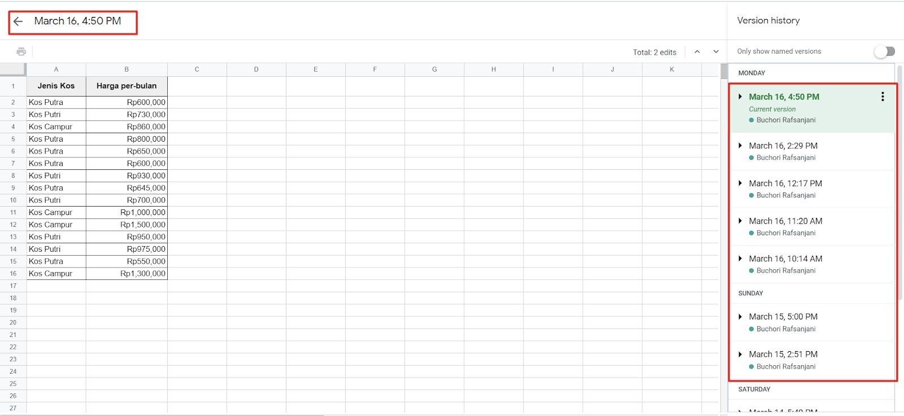

tags:: #[[Machine Learning]] #[[Data Analysis]] #[[Dasar Visualisasi Data]] #Metadata #Version Control

- Dokumentasi data atau sering disebut **data provenance** adalah sebuah langkah untuk melihat sumber data yang kita peroleh.
- Dokumentasi data dapat ditujukkan dalam sebuah **metadata**[^1], **version control**[^2]
	- [^1]: {{embed ((63425c8a-2b59-4329-ad56-81f311c69ece))}}
		- {:width 500}
			- source: [Kaggle](https://www.kaggle.com/sudalairajkumar/novel-corona-virus-2019-dataset/metadata)
	- [^2]: {{embed ((6342630b-a51e-40e2-981f-ad1568e4745a))}}
		- {:height 244, :width 498}
		- source:
-