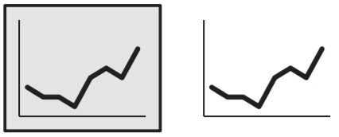
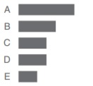

tags:: #Figure–ground

- Dalam teori persepsi visual, terdapat prinsip Gesalt yang menyatakan bahwa seesorang cenderung mengelompokkan sesuatu yang dilihat menjadi satu kesatuan utuhu berdasarkan pola, hubungan, dan kemiripan
	- 
	- see more: [[Rubin's vase-face]]
- # Proximity
	- 
- # Similiarity
	- {:height 239, :width 256}
- # Enclosure (Pembeda)
	- 
- # Closure
	- Konsep ini cenderung memandang sekumpulan objek yang terpecah-pecah sebagai bagian dari satu objek yang lengkap
	- 
- # Continuity
	- Sumbu-Y dapat terbentuk secara imajiner karena grafik batang sejajar rata kanan
	- Dengan begini ktia dapat menghapus garis sumbu-Y agar terlihat lebih bersih
	- {:height 218, :width 211}
- # Connection
	- 