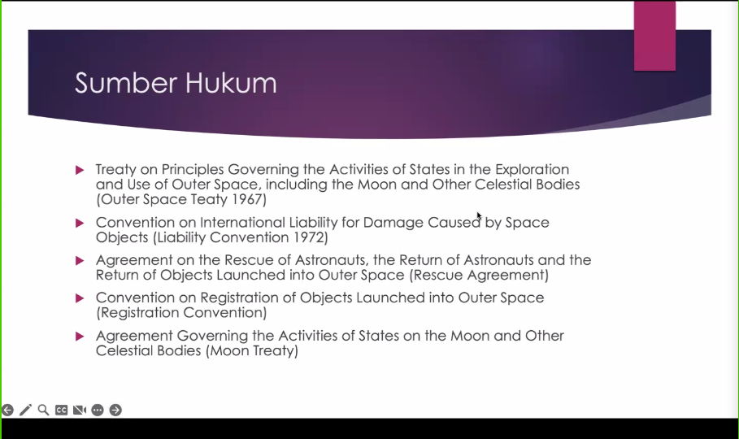
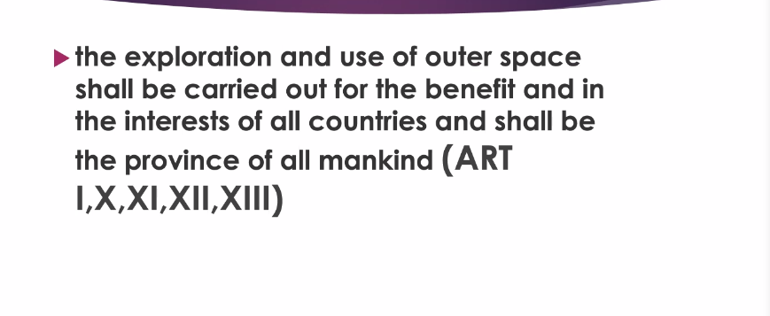
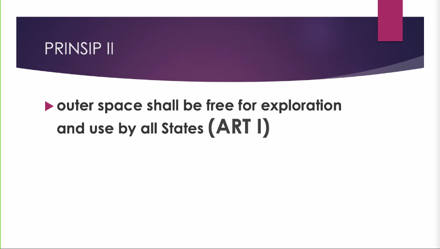
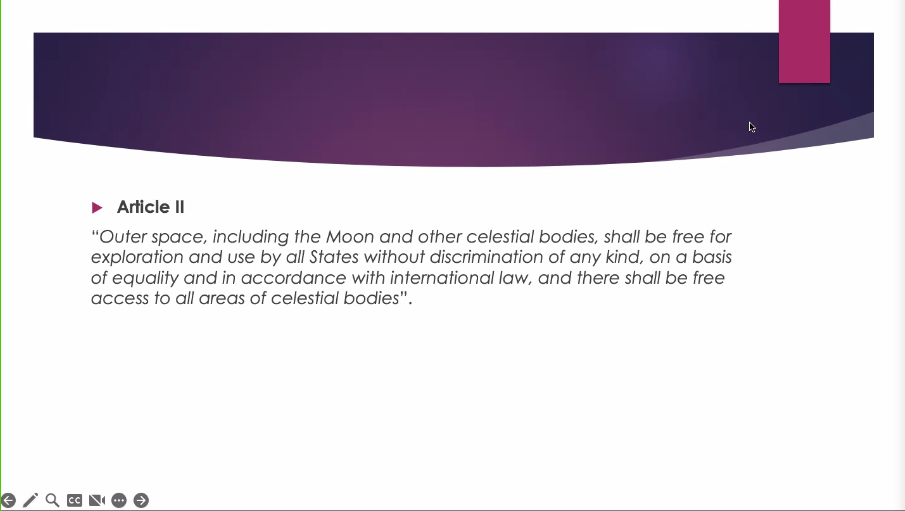
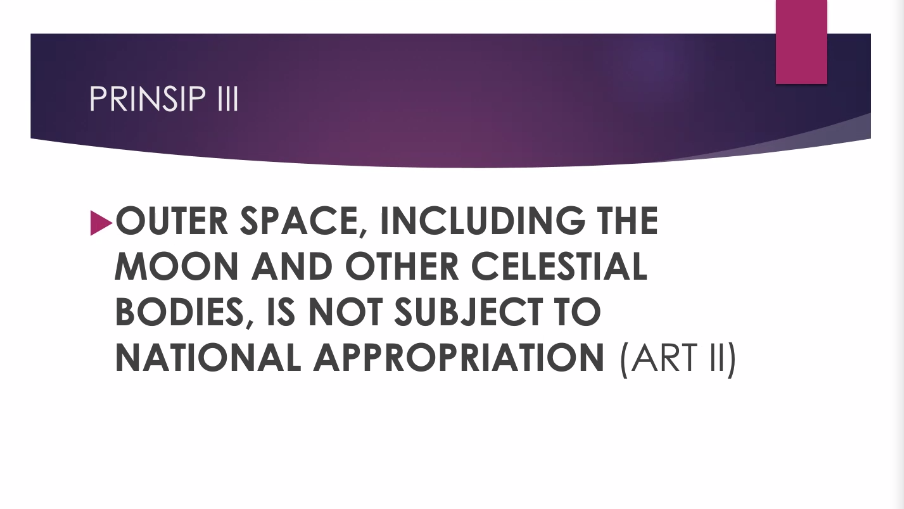

public:: true

- Bisa dikategorikan ke dalam dua kelompok:
	- 
	- ## Human-made
		-
	- ## Natural
		- another terms: _celestial bodies_
		- tidak ada yang bisa dimintai pertanggungjawaban. Masa minta ke Tuhan: "Tuhan aku minta ganti"
- # Prinsip Hukum Ruang Angkasa
	- Lebih ditujukan kekhawatiran negara-negara yang pada saat itu tidak bisa beraktivitas di luar angkasa.
	- Takut hanya negara maju yang bisa beraktivitas
	- Supaya damai, tidak menimbulkan kekhawatiran
		- ## Outer Space Teaty (1967)
			- Dibuat hanya dalam satu tahun
			- Dibuat sangat general, ceunah
			- Kata bapaknya udah nggak relevan, dan butuh yang baru karena teknologi terus berkembang
			  collapsed:: true
				- ini prinssip tahun 67 bro, banyak celahnya, katanya
			- ### The principes:
				- #### Prinsip 1
					- click to see the thumbnails
					  collapsed:: true
						- 
					- prinsip ini dicomot2 terus dijadiin satu, ceunah
					- semuanya mendapat keuntungan
					- prinsip ini muncul agar semua negara mendapat manfaatnya, meskipun tidak bisa/ikut berkativitas ke luar angkasa
					  collapsed:: true
						- citra jarak jauh, satelit, gps, glonass
					- muncul permasalahan setelah tahun 2000-an
					  collapsed:: true
						- karena kata ilmuwan asteroid bisa ditambang
						- dananya nggak murah
						- nggak tau terus bahas elon musk katanya orang gila. nggak tau dananya dapet dari mana
						- afah iyah mereka (SpaceX, dll.) bakalan patuh sama prinsip 1 (_shall be carried out for the benefit and in the interests of all countries_)
						- terus bahas cina
						- terus bahas the dark side of the moon lanjut bahas decepticon trnasformers
						- terus cina nemu bahan dari bulan yang jumlahnya <1kg katanya beritanya banyak
						- entah omong kosong atau pamer
						- terus eropa minta ke cina, "boleh nggak, Ci, minta dikit?"
						- terus ditolak
						- loh katanya, "_shall be carried out for the benefit and in the interests of all countries_"
						- anjir terus bahas project artemis (see: Andy Weir's Project Artemis) karena masalah2 tersebut
				- ### Prinsip 2
					- click to see the thumbnails
					  collapsed:: true
						- 
						- 
						- kata Alya Agata ini omong kosong terus bapaknya sepakat (sianjim pinter sia)
					- walaupun bebas tpi cmn beberapa yang bisa melakukan hal explorasi (ini ktanya kenapa prinsip 2 juga bullshit, malah jadi bumerang)
						- dongeng kedua: space-tourism (see Blue Origin's Jeff Besoz)
							- Orang pertama yang space-tourism, Dannis Vito(?) orang Ruski bayar x usd
							  collapsed:: true
								- cmn di low orbit
							- perwujudan dari "_...free for exploration..._" dan nggak melanggar, katanya. Ya nggak salah, sih
				- ### Prinsip 3
					- click to see the thumbnails
					  collapsed:: true
						- 
						-
					- ada ceritanya di Indonesia, katanya, tpi terlalu panjang
						- akhirnya cerita
						- pas presidennya bu mega, meratifikasi(?)
						- karena Indonesia pernah men-challenge prinsip ini
						- cerita challenge-nya besok depan, katanya
		- ## Liability Convention (1972)
		- ## Rescue Agreement
		- ## Registration Convention
		- ## Moon Treaty