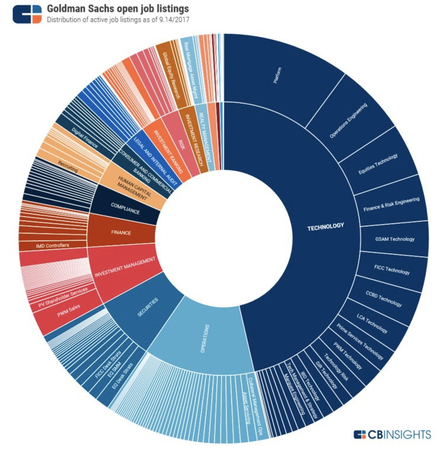
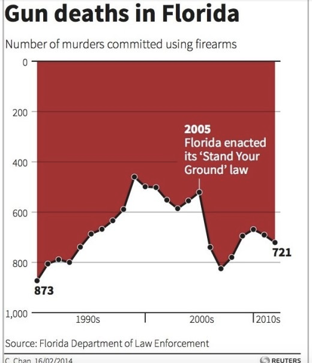

- # Nilai Presentase Tidak Sesuai
	- Tidak berjumlah 100%
	- Terlalu banyak irisan yang berujung bias. Hal ini dapat diatasi dengan menambahkan kategori "lainnya" yang mencakup semua irisan-irisan kecil.
	- Pada kategori lainnya juga harus diberi keterangan lebih detil yang menjelaskan apa saja isi dari kategori tersebut
- # Terlalu Banyak Data
	- 
- # Tidak Mengikuti Standar Penulisan
	- Sekilas tidak ada yang salah dalam visualisasi data tren pembunuhan di bawah ini:
		- 
		-
	- Namun, pada sumbu Y, angka skala positif menunjukkan arah yang salah. Jelas standar penulisan ini sudah salah.
	- Terlebih, posisi warna yang mengisi grafik salah. Hal, ini membuat grafik sekilas dilihat memiliki angka yang ambigu. (see more: [[Figure–ground]])
	- #