- Term:
	- Corrective maintenance
	- preventive maintenance
	- LCC
- # Factor that cause structure to deteriote
	- ## Breeding that occurs in concrete
		- W/C large
		- unit weight of water large
		- ### Initial defects due to breeding
			- sinking and cracking
			- 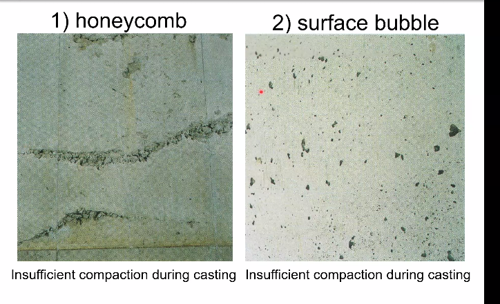
			- 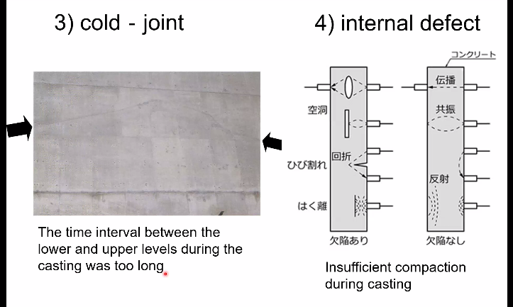
			- 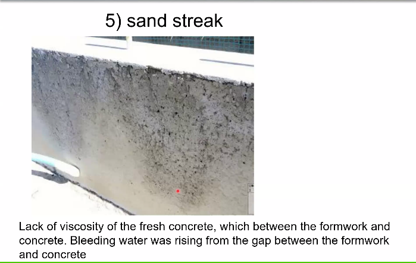
			- ### Degradation over time
				- 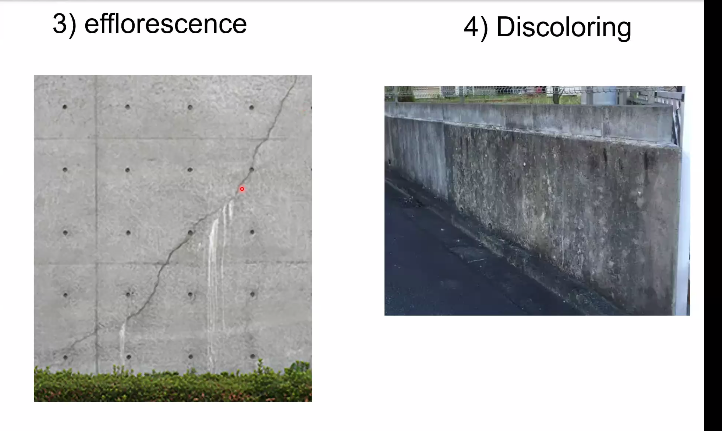
	- ## Carbonation
		- ### Def
			- 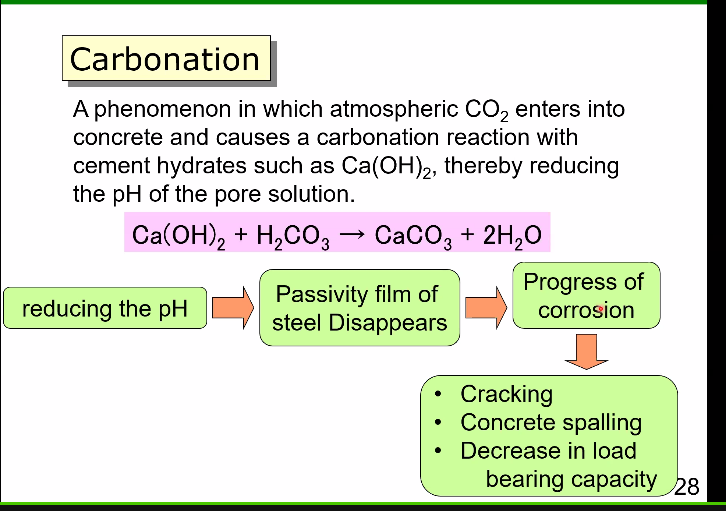
		- ### Test method
			- 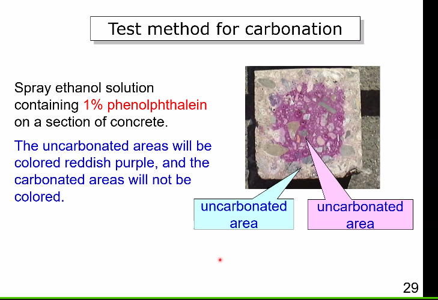
		- ### Example
			- 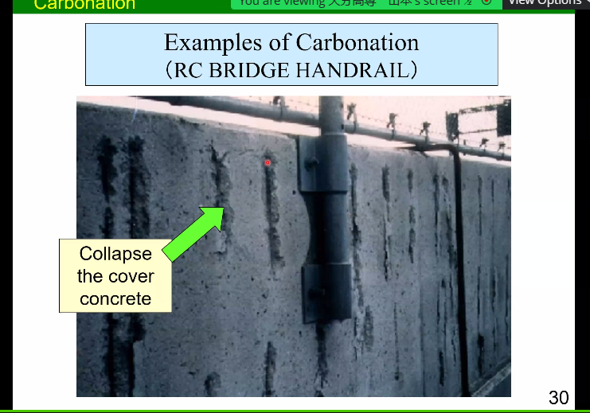
			-
		- ### Mechanism
		  collapsed:: true
			-
			- 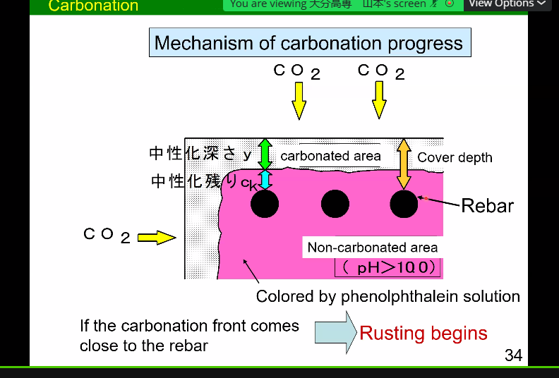
		- ## Salt damage
			- 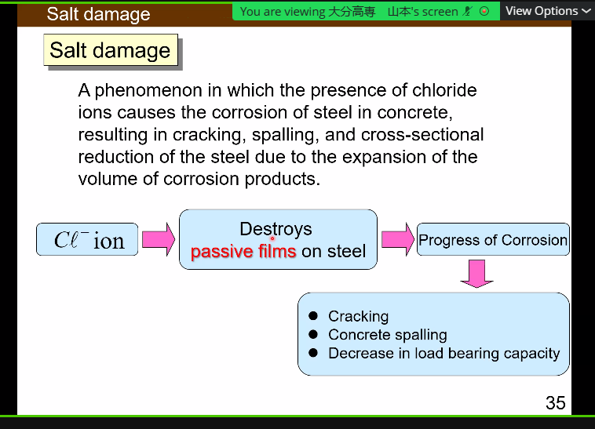
			- 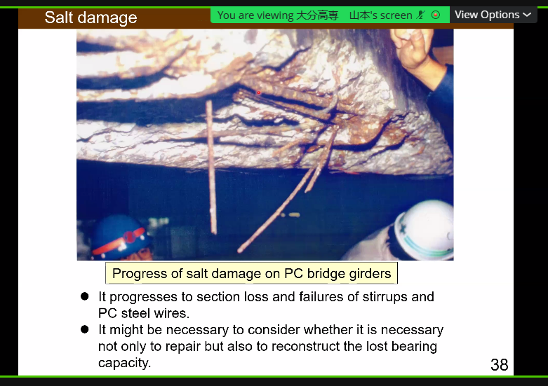
		- ## ASR
		- ## Fatigue fracture
			- 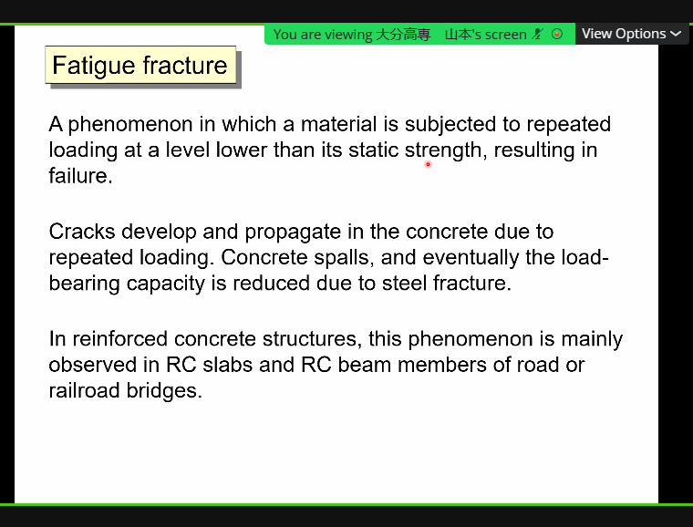
- # A good conrete
	- 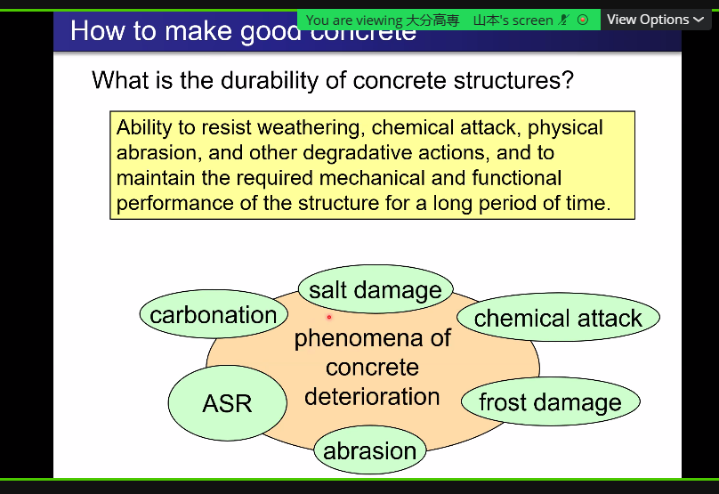
	- 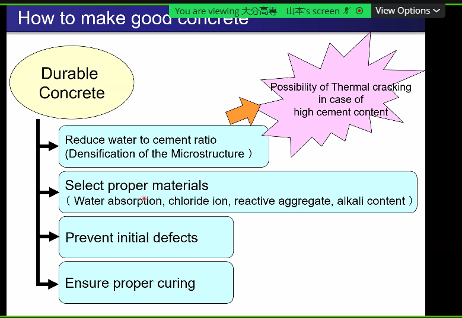
	- 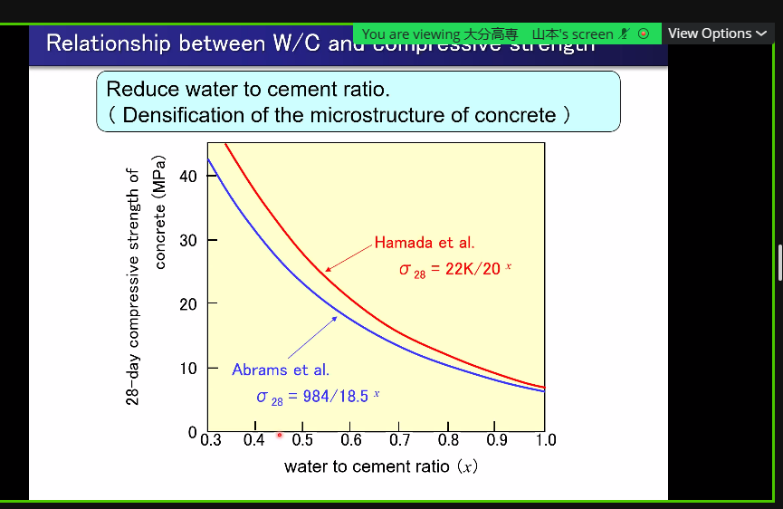
	- 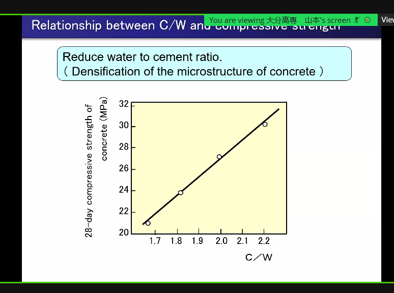
	- 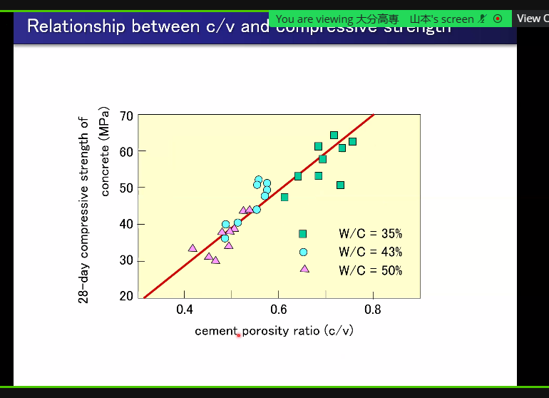
	- 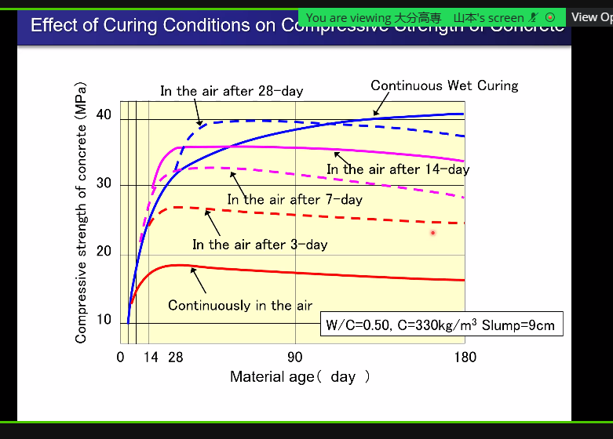
	- 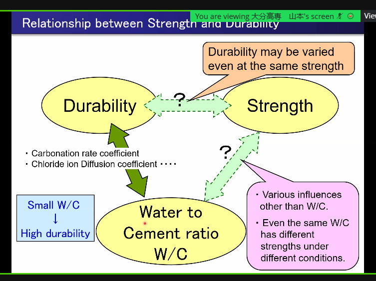
	- 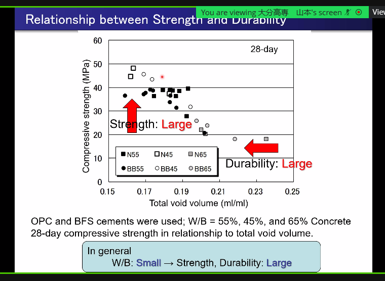
	- 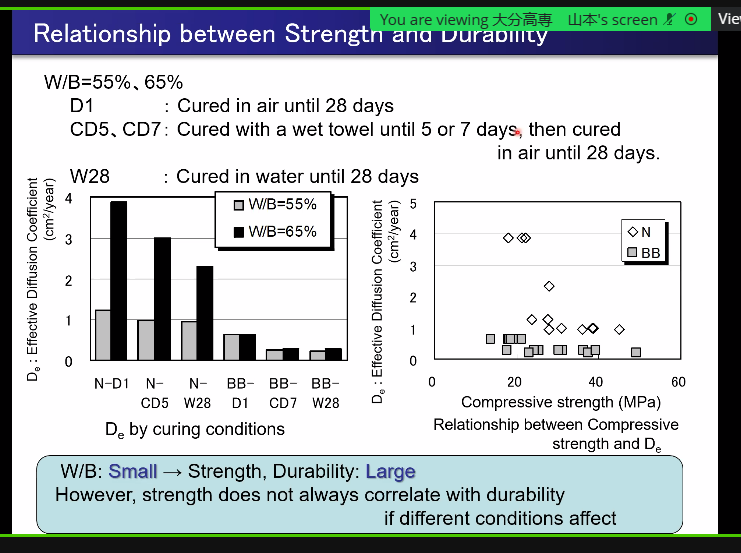
	- 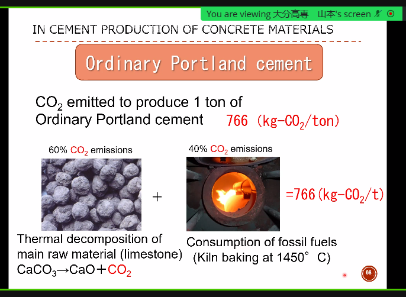
	- 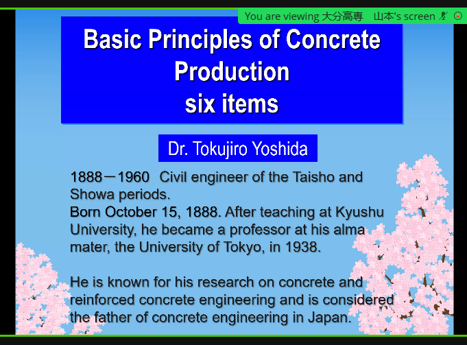
	- 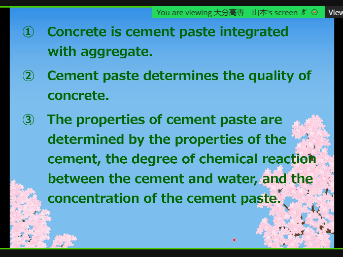
	- 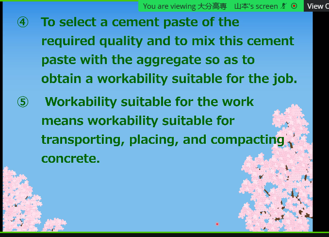
	- 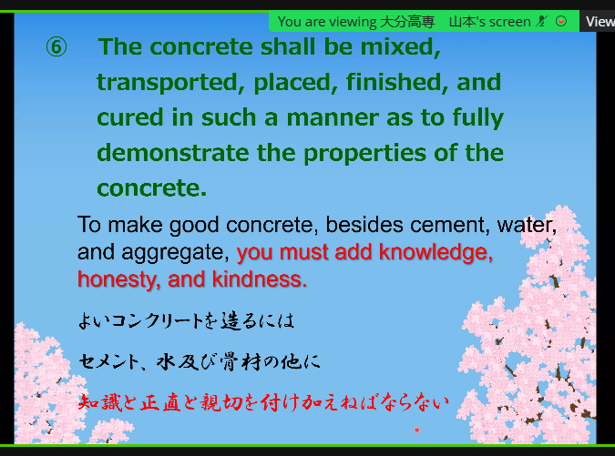
	- # Sum
		- Kerusakan oleh ASR (alkali-silika)
		- ... fracture
			- beban yang terus menerus
		- ## Tips to make good cocnrete
			- proper media
			- proper mix design
			- proper material
			- sesuai standar
			- proper construction
				- pada saat konstruksi dilaksanakan dengna baik
		- ## Environment
			-
			-