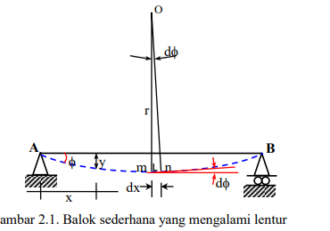

tags:: #Compression #Tensile

- ### [[Sep 21st, 2022]]
	- > clockwise $\rightarrow-$
	  anti-clockwise(counterclockwise) $\rightarrow +$
	- 
	- Berdasarkan gambar 2.1. didapat:
	- $dx = r \tan{d\phi}$
		- besar $dx$ muncul karena terjadi #Tensile dan #compression saat #beam melengkung, sehingga titik potong yang dibentuk oleh $mO$ dan $AB$ berpindah ke titik potong yang dibentuk oleh garis $nO$ dan $AB$ yang relatif terhadap besar sudut $d\phi$
		- besar sudut $d\phi$ yang terbentuk oleh garis merah sama dengan besar sudut $d\phi$ yang terbentuk oleh garis hitam
			- garis merah merupakan garis singgung yang tegak lurus dengan garis $mO$ dan $nO$
	- Karena besarnya $d\phi$ relatif sangat kecil, maka $\tan{d\phi} = d\phi$, sehingga persamaannya dapat ditulis menjadi:
		- TODO proof that if $d\phi$ close to 0 then $\tan{d\phi} = d\phi$
	- $dx=r\cdot d\phi$ 
	  atau
	- $\frac{1}{r} = \frac{d\phi}{dx}$