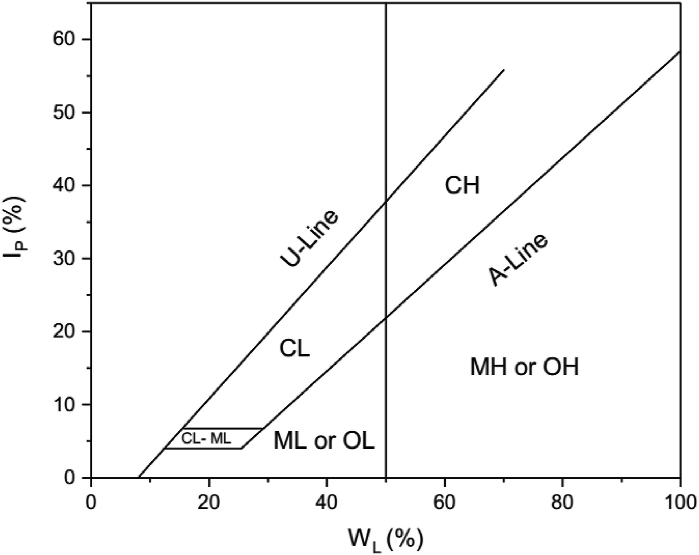
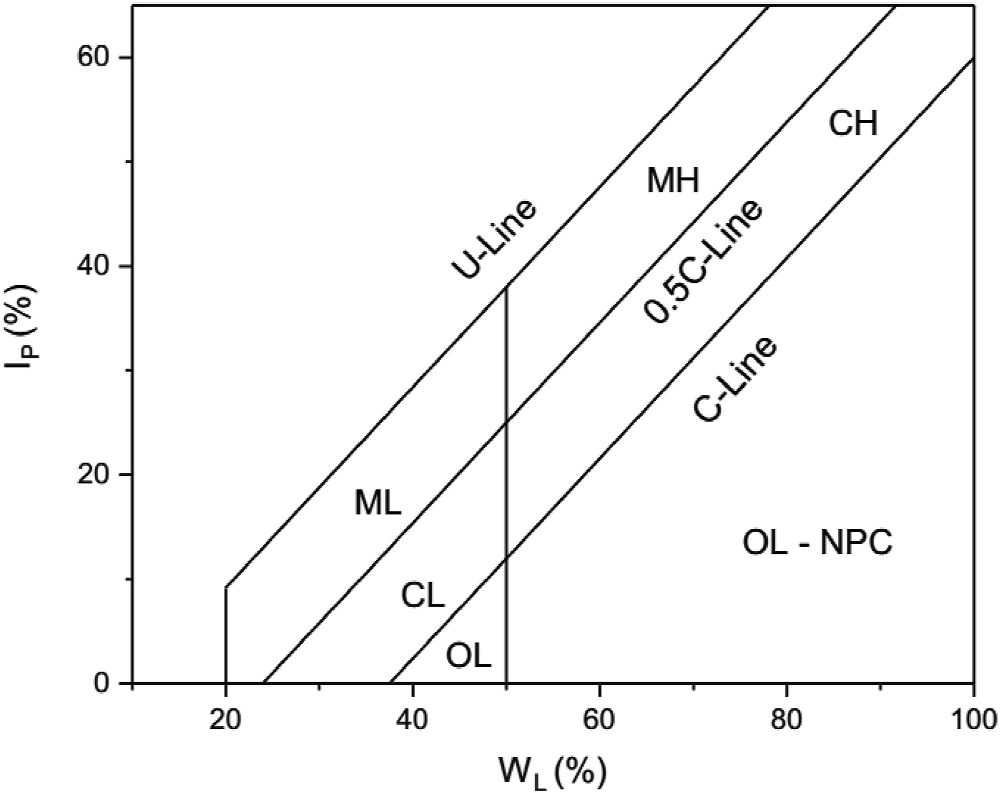

- # Casagrande's plasticity chart[^1]
  id:: 63479de8-f891-4791-aa37-20d4fd3c5130
	- 
	  collapsed:: true
		- ((63479e1d-821f-44cb-9836-6c8af62b04cb))
- # Polidori's plasticity chart[^2]
	- 
		- ((63479e8a-4b1c-4235-bd41-c93e1a1b07bf))
- # References
- [^1][^2][[@The use of Polidori's plasticity and activity charts in classifying some residual lateritic soils from Nigeria]]