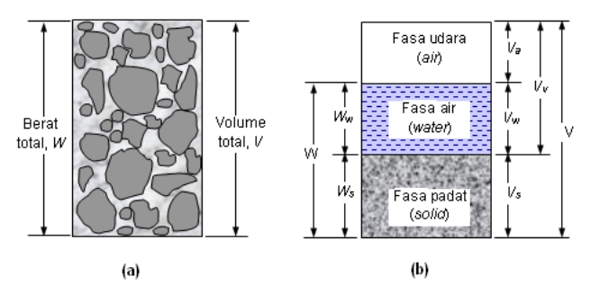
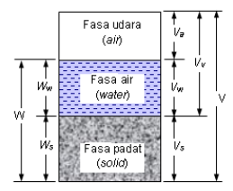

:PROPERTIES:
:ref: 
:END:

- # Pendahuluan
	- {:height 335, :width 676}
	  id:: 633329bd-915b-4f15-8301-dff4c6f686d4
		- $W$ =  *weight*
		- $W_w$ = *weight of water*
		- $Ws$ = *weight of solid*
		- $Va$ = *Volume of air*
		- $Vw$ = *Volume of water*
		- $V_s$ = *Volume of solid*
		- $V_v$ = *Volume of void*
		- $V$ = *Volume*
	- Elemen tanah terdiri dari 3 fase penyuusn tanah: udara, air, padat
	- 3 Fase ini sering disebut *three-phase systems*
- # Hubungan Berat--Volume
	- ((63333f2c-0f77-46dd-bc89-64c5b1941b8e))
	- id:: 63333f37-4992-4582-8e87-485f1c524c44
	  $$\begin{align}\begin{split}V &= V_s + V_v = V_s + V_w + V_a\\
	  1 &= V_s + V_v = V_s + V_w + V_a\end{split}\end{align}$$
		- 
		- di mana:
		- $$\begin{equation}V_s = V-V_v = 1-\left(\frac{V_v}{V}\right)\end{equation}$$
			- Volume batuan (*solid*) diperoleh dari pengurangan volume keseluruhan dengan volume pori (*void*).
		- $$\begin{equation}V_v = \left(\frac{V_v}{V}\right)\end{equation}$$
	- ((6333b903-60ae-4c16-a788-12205939d948))
	- $$\begin{equation}W = W_s + W_w\end{equation}$$
	- Hubungan volume digunakan untuk mengukur perbandingan antara:
		- ### [[Angka Pori]]
		- ### [[Porositas]]
		- ### [[Derajat Kejenuhan]]
	- #admon-bug Critical Bug
		- circadian rhythm