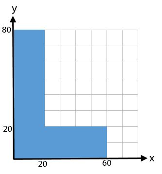
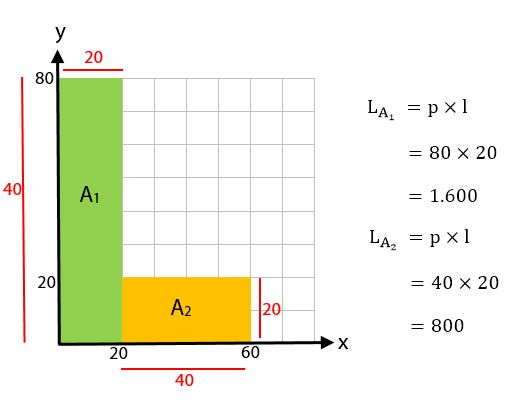
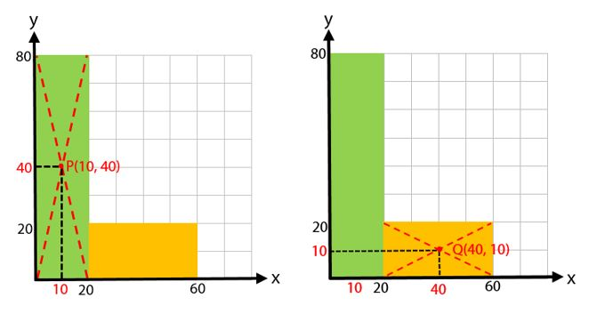
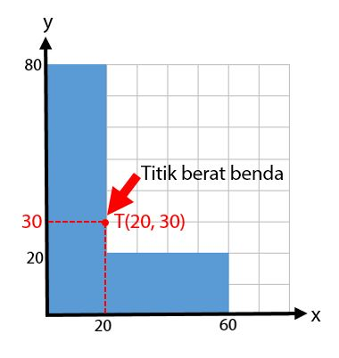

keyword:: [[Dua Dimensi]]

	- $$x_0 = \frac{A_1 x_1 + A_2 x_2 + \dots + A_n x_n}{A_1 + A_2 + \dots + A_n}$$
	- $$y_0 = \frac{A_1 y_1 + A_2 y_2 + \dots + A_n y_n}{A_1 + A_2 + \dots + A_n}$$
- Contoh:
	- 
		- Bagi bangun tersebut menjadi dua bagian
		- Kemudian cari luas pada setiap bangun tersebut, sehingga diperoleh $A_1 dan A_2$
			- 
		- Kemudian, tentukan koordinat titik berat dari setiap bangun tersebut dengan membuat garis diagonal pada setiap bangun.
			- 
		- Mencari $x_0$ (absis titik berat)
			- $$\begin{align}x_0 &= \frac{A_1 \cdot x_1 + A_2 \cdot x_2}{A_1 + A_2}\\ 
			  &= \frac{1600 \cdot 10+ 800 \cdot 40}{1600 + 800}\\
			  &= \frac{16000+ 32000}{2400}\\
			  &= \frac{48000}{2400} = 20\end{align}$$
		- Mencari $y_0$ (ordinat titik berat)
			- $$\begin{align}y_0 &= \frac{A_1 \cdot y_1 + A_2 \cdot y_2}{A_1 + A_2}\\
			  &= \frac{1600 \cdot 40 + 800 \cdot 10}{1600 + 800}\\
			  &= \frac{64000 + 8000}{2400}\\
			  &= \frac{72000}{2400} = 30\end{align}$$
		- Kemudian diperoleh $x_0$ dan $y_0$. Nilai koordinat inilah yang merupakan titik beratnya
			- 