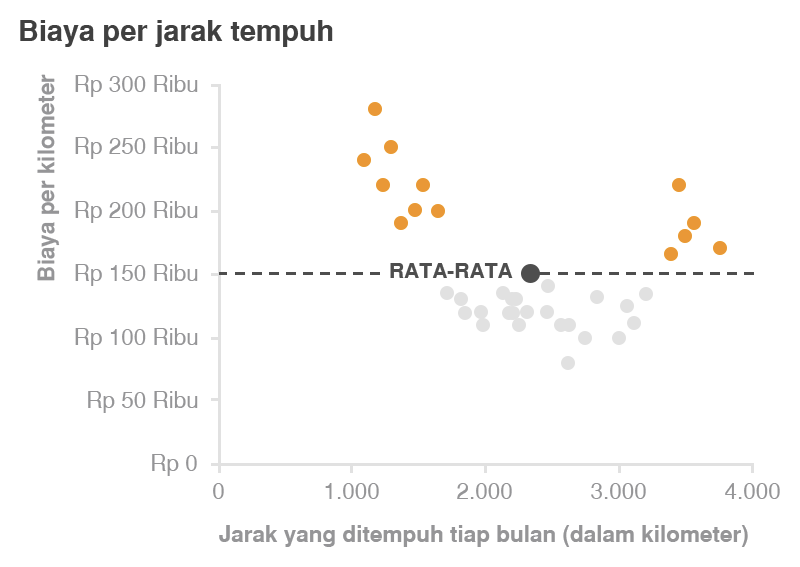

- Walaupun terdapat banyak jenis dalam memvisualisasikan data, hanya terdapat beberapa yang mampu secara efektif menjawab kebutuhan kita
- # Teks
	- Gunakan untuk menampilan satu atau dua angka saja
	- Hindari penggunaan grafik pada kasus seperti di bawah ini yang hanya menampilkan sedikit angka
		- {:height 411, :width 280}
		- alternatif lain adalah seperti di bawah ini:
			- {:height 143, :width 186}
			-
- # Tabel
	- Bersifat universal, karena audiens dapat menggunakannya sesuai kebutuhannya masing-masing.
	- Hal-hal yang perlu diperhatikan:
		- Garis tepi yang tebal atau bayangan
		- warna
		- background row
		- 
- # Heatmap
	- Grafik yang menggabungkan detail angka pada tabel dengan warna pada setiap cell-nya bergantung pada nilai cell itu sendiri
	- Lebih efektif untuk membandingkan nilai
		- 
- # Grafik
	- ## Titik
		- ### Scatterplot
			- Untuk menunjukkan hubungan antara dua hal dengan koordinat sumbu x dan y
			-
			- {:height 332, :width 457}
			- {:height 326, :width 457}
	- ## Garis
		- ### Grafik Garis
			- Untuk data yang bersifat kontinu (berkelanjutan)
			- Tidak sesuai untuk data yang bersifat kategoris: perbandingan jenis kelamin, makanan kesukaan
			- Sering kali  data kontinu berupa unit waktu: hari, bulan, kuarter, tahun
			- 
		- ### Slopegraph
			- Hanya menampilkan perubahan pada dua titik saja
			- Diperuntukan untuk fokus pada kenaikan (differential)
			- Jika slopegraph terlalu banyak yang berpotongan, mungkin kurang efektif
			- {:height 483, :width 465}
	- ## Batang
		- Walaupun paling banyak dijumpai, bukan berarti harus dihindari.
		- Paling efektif, karena semua audiens dapat membacanya dengan mudah
		- Perlu diingat, sumbu-Y dimulai dari nol agar perbandingan visual tidak salah
			- 
		- Lebar batang harus lebih besar dibandingkan jarak antara batang
			- 
		- ### Jenis grafik batang:
			- #### Grafik Batang Vertikal
				- Gunakan grafik multiseri jika seri data semakin banyak
				- Perhatikan penyesuaian visual kategorisasi
					- 
				- #### Grafik Batang Vertikal Bertumpuk
					- Cocok untuk perbandingan antar kategori utama dan juga antar sub komponen (penurunan/kenaikan pada suatu kategori) dalam tiap kategori
					- Kurang efektif apabila salah satu warna subkomponen tidak sejajar, seperti ilustrasi di bawah:
						- 
				- #### Grafik Air Terjun (Waterfall)
					- Uraian dari grafik batang bertumpuk
					- Untuk lebih fokus menunjukkan data awal, kenaikan atau penurunan yang terjadi, serta data akhir, seperti memberi timeline
					- 
				- #### Grafik Batang Horizontal
					- Diperuntukan jika nama kategori panjang
					- 
				- #### Grafik Batang Horizontal Bertumpuk
					- Untuk menunjukkan perbandingan antara kergori total dengna antarsub komponen di tiap kategori
					- Karena kita grafik ini menggunakan garis dasar yang konsisten baik ujung kiri maupun ujung kanan, maka dapat memvisualisasikan porsi keseluruhan skala dari negatif hingga positif
					- {:height 336, :width 513}
	- ## Area
		- Paling dihindari karena manusisa tidak terbiasa dengan visualisasi dua dimensi
		- Gunakan hanya untuk memvisualisasi data yang besar perbedaan angkanya sangat tinggi
		- 